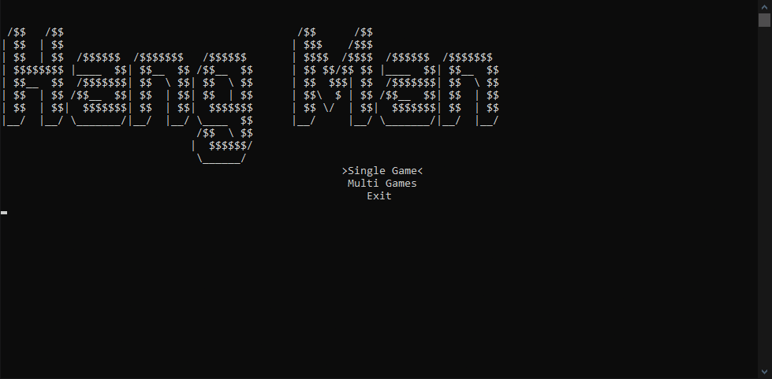
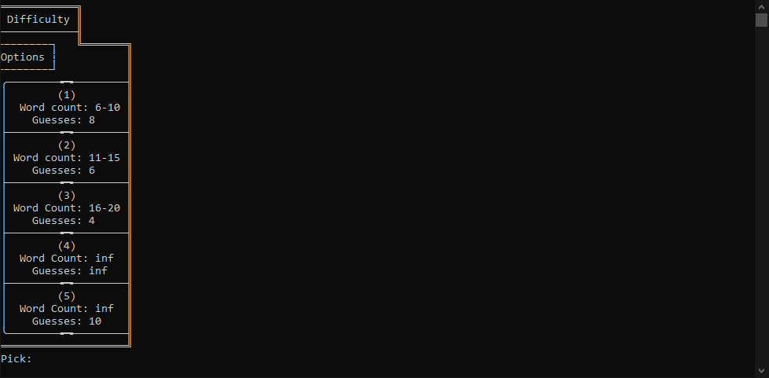
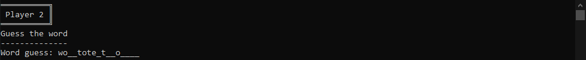
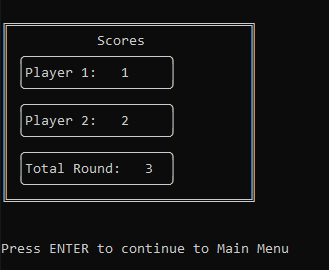

# Guess the word Exercise 4
## Introduction
This, unlike the previous 3 exercises, was written in a way to add a menu which is controlled using arrow keys. It currently has 3 options (SinglePlayer, MultiPlayer and Exit). I’ll talk in detail about all of them later.  I used a lot of different “artistic” decisions so I could make the console look more alive and more text like. I decided on using console over GUI as I wanted to play around with making console menu and because Hangman or “Guess the word” is a text-based game so creating a GUI would make it look less astatic than console would.
## Features and Demonstrations
### Menu
One of the main features of this program is the menu. I made it in a dynamic way so the menu items can be added onto, removed and possibly even dynamically added on. 
  
### Game
The game itself is used from the previous exercises but is edited to fit this one and have boosted performance.
#### Difficulty Selection
  
This the Difficulty Selection that shows up when you choose the game type (singleplayer or multiplayer)
#### Extras
  
The game, once you have decided to guess or used up all guesses. Shows what you got so far to guide you on what you have to type.
### Single Game
One of the 2 game options that you can pick from is single game. This just means you play a single game and then the game ends.
### Multi Game
Multi game is just single game but it goes a couple times. You have to type in “end” to end the game and get the results
#### Result table
  
Here is the result table that shows you all the wins from both sides and etc
